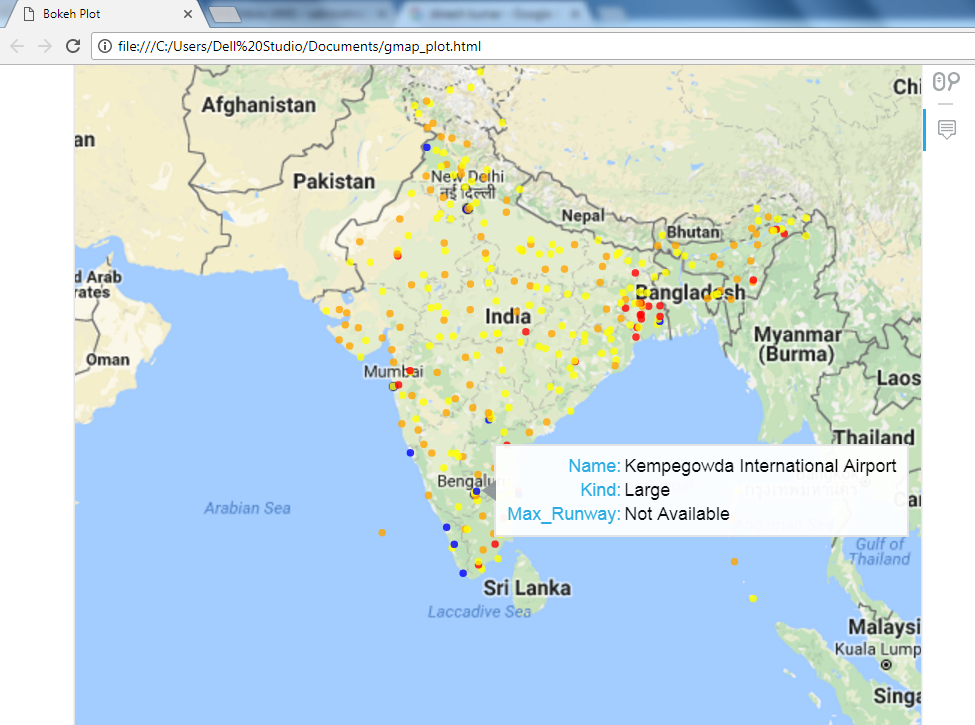

Pulls location data for India Airports from http://www.fallingrain.com/world/IN/airports.html and plots them on a map using Bokeh as below:

Points are color coded as follows:
1) Blue: Large airports
2) Orange: Medium-sized airports
3) Yellow: Small airports
4) Red: Closed airports

In addition, a tooltip appears on each point when hovered.
The tooltip displays the below fields:
1) Name
2) Kind (Small/Medium/Large)
3) Max_Runway (for Airports where this information is available)

A note on the data:

The data is not limited to only commercial airports. For instance around Bangalore, apart from the Kempegowda International Airport, the data includes the HAL Airport (labelled simply as 'BANGALORE') and the Yelahanka Air Force Station. Both of these airports are only used for Defence purposes now.

However, the data does not include the 'Kushok Bakula Rimpochhe Airport' which serves the city of Leh, so the list is incomplete in terms of commercial airports as well.

