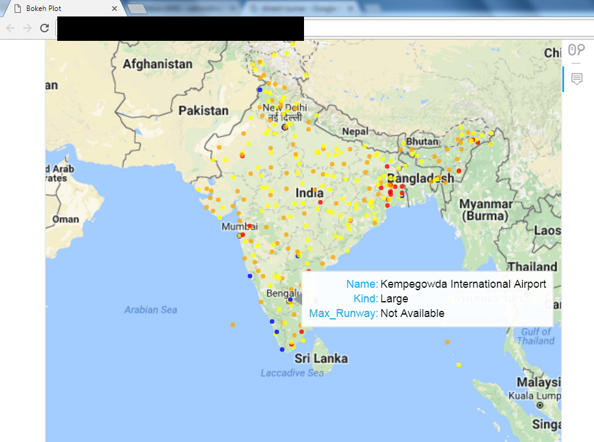

Pulls location data for India Airports from http://www.fallingrain.com/world/IN/airports.html and plots them on a map using Bokeh as below:

Points are color coded as follows:
1) Blue: Large airports
2) Orange: Medium-sized airports
3) Yellow: Small airports
4) Red: Closed airports

In addition, a tooltip appears on each point when hovered.
The tooltip displays the below fields:
1) Name
2) Kind (Small/Medium/Large)
3) Max_Runway (for Airports where this information is available)

A note on the data:

The data is not limited to only commercial airports. For instance around Bangalore, apart from the Kempegowda International Airport, the data includes the HAL Airport (labelled simply as 'BANGALORE') and the Yelahanka Air Force Station. Both of these airports are only used for Defence purposes now.

However, the data does not include the 'Kushok Bakula Rimpochhe Airport' which serves the city of Leh, so the list is incomplete in terms of commercial airports as well.

A note on the Bokeh toolbar :

The Bokeh toolbar is a customizable toolbar located at the right of the image as above. It has the below options (from top to bottom):

1) Link to Bokeh home page: Clicking on it will open http://bokeh.pydata.org/en/latest/ where you can read more about Bokeh.
2) Pan: Allows you to navigate across the map in the GMapPlot. You might need to use the Pan tool in order to view the 'PORT BLAIR' airport, for instance.
3) Wheel Zoom: As the name suggests, this lets you zoom the GMapPlot. While this works on Chrome, the wheel zoom is not as responsive as you'd like it be. You would need to wheel zoom in/out a couple of times before the plot begins to respond.
4) Hover Tool: When activated (blue line next to the Hover tool button, any tooltips configured with the GMPlot will appear when a point is hovered over.

Each of the above tools can be toggled on/off by clicking on the respective button. When a tool button has a blue ribbon on it's left, that means the tool is activated. For instance in the screenshot above the Pan and the Hover tool are activated, but the wheel zoom tool is not.
